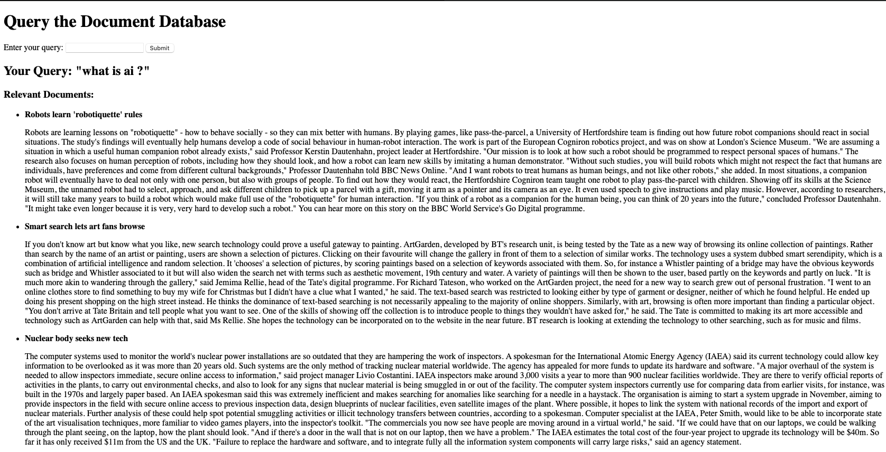
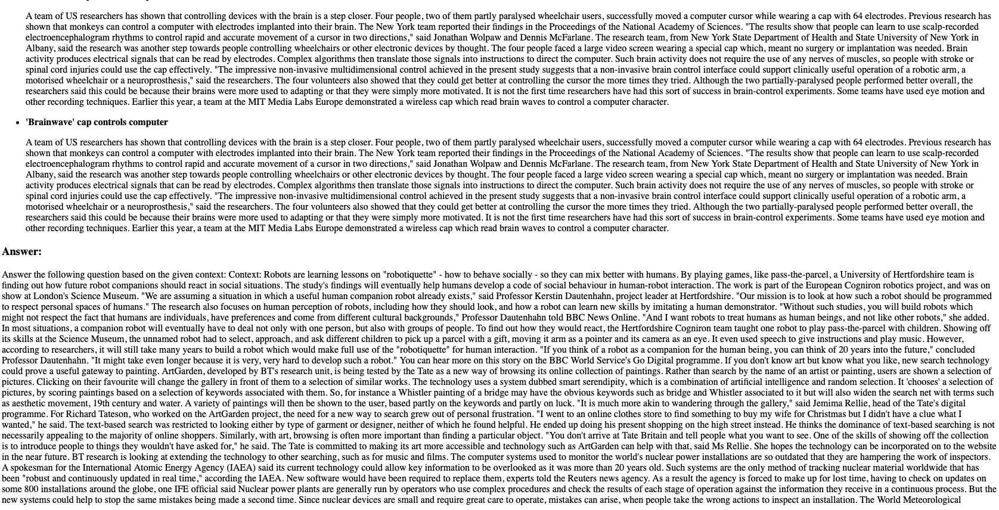

# InfoQuest : A lightweight RAG pipeline

# Project Overview
This project implements a robust Retrieval-Augmented Generation (RAG) system using MongoDB, FAISS (Facebook AI Similarity Search), and language models. It is designed to efficiently store, retrieve, and generate contextually relevant answers based on a large corpus of documents. Below is a detailed description of the functionalities provided by the implementation and Web-app interface:

# Key Components
1. Document Processing and Storage
The project begins by processing a dataset of textual documents and storing them in a MongoDB collection. Each document is enriched with semantic embeddings generated using a transformer-based Sentence Embedding model. These embeddings are vector representations of the textual content, enabling fast and accurate similarity searches later.

Dataset Loading: Documents are loaded from a CSV file, which contains textual content along with optional metadata such as titles or IDs.
Embedding Generation: Each document is processed using the lightweight all-MiniLM-L6-v2 transformer model to compute high-quality semantic embeddings.
MongoDB Integration: The processed data, including document content, metadata, and embeddings, is stored in MongoDB for persistent storage and retrieval.
2. Semantic Search and Query Handling
A Flask-based web application provides a user interface for querying the stored documents and retrieving contextually relevant results. This system leverages FAISS for efficient similarity searches and GPT-Neo for generating contextually relevant responses.

Semantic Search with FAISS:
The stored document embeddings are indexed using FAISS, enabling fast similarity searches. When a query is received, its embedding is computed and compared with the indexed embeddings to identify the most relevant documents.

Contextual Answer Generation:
A pre-trained GPT-Neo language model is used to generate natural language answers based on the retrieved documents and the user's query. The system constructs a context using the top-k relevant documents and formulates a coherent and informative answer.

# Application Features
Preprocessing Pipeline: Automates the process of generating embeddings from documents and storing them in a database.
Semantic Retrieval: Efficiently retrieves the most relevant documents for any user query using FAISS.
Contextual Response: Combines document retrieval with a powerful language model to provide detailed answers in natural language.
Interactive Web Interface: A Flask-based front-end allows users to submit queries, view relevant documents, and get detailed answers.
Use Cases
Knowledge Management Systems: Quickly retrieve relevant information from a large corpus of documents and provide concise answers.
Customer Support: Use pre-existing customer support documents to answer user queries in natural language.
Research Assistance: Retrieve and summarize information from research papers or large datasets for academic purposes.
This project demonstrates the integration of state-of-the-art natural language processing techniques with scalable database and retrieval systems to build an efficient and practical RAG pipeline.